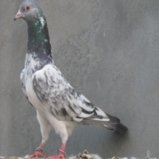
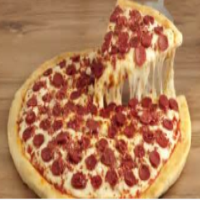

# Pizzageon

Comparing a Vanilla Neural Network and a Convolutional Neural Network performances on a small dataset consisting of pizzas and pidgeons.

 


## What to do

In the console:

```
> python create_dataset_pickle.py
```

This will create a dataset.pkl file that will be used by the jupyter notebook.
The jupyter notebook already have saved output if you just want to look at it.